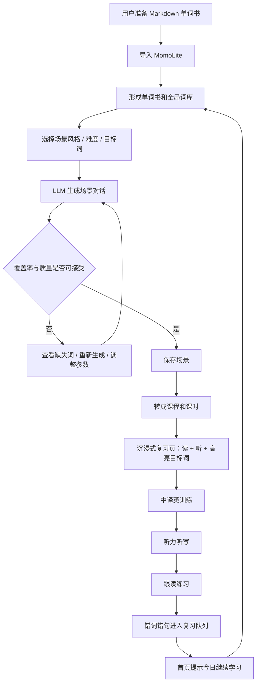
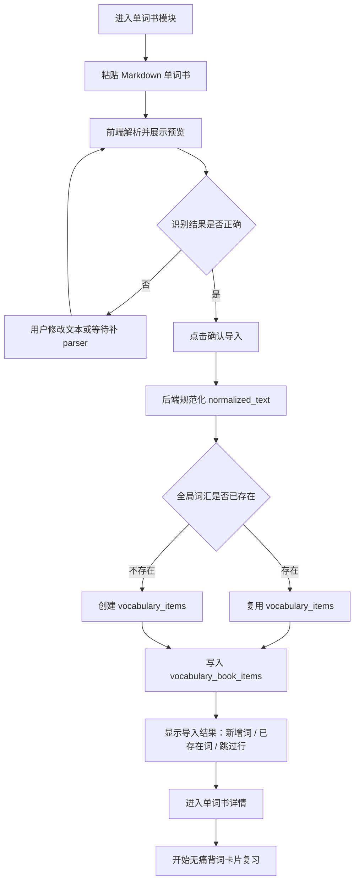
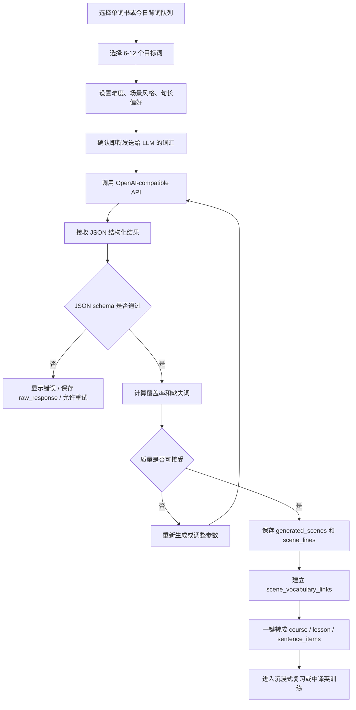
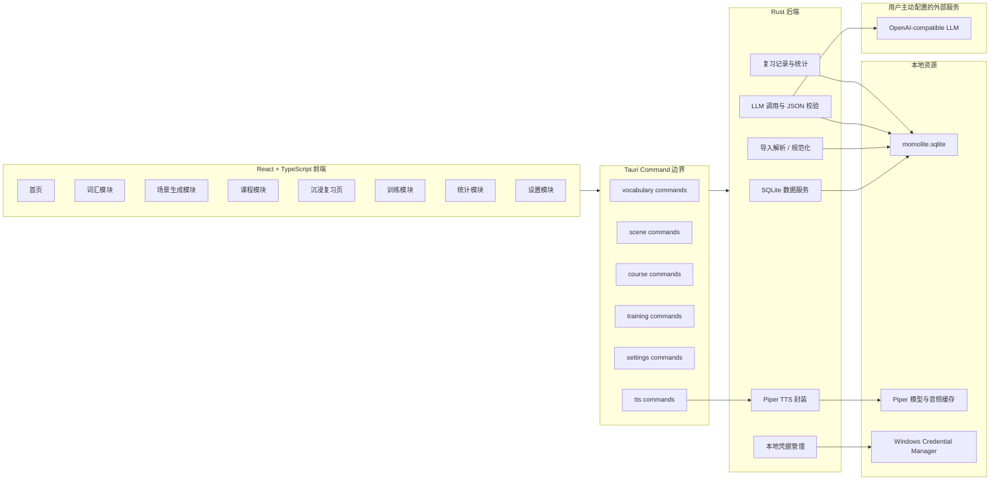
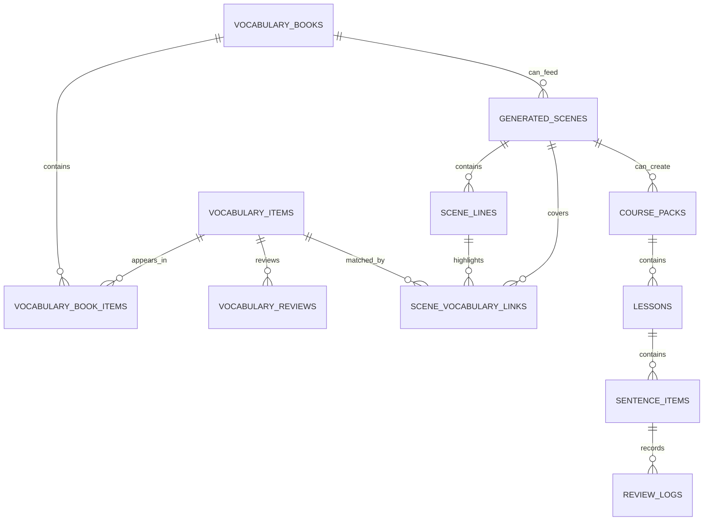

# MomoLite 升级开发用户流程与架构设计

更新日期：2026-04-27

本文档用于指导 MomoLite 从当前 MVP 升级到“单词书导入 -> 无痛背词 -> LLM 场景生成 -> 沉浸复习 -> 多模式训练 -> 错词错句复习”的产品形态。它是开发执行图，不替代总交接文档。

## 1. 产品主线

MomoLite 的核心主线：

```text
今天背过的词
-> 生成真实日常对话
-> 看懂
-> 听懂
-> 打出来
-> 说出来
-> 过几天还能想起来
```

产品要避免变成“功能很多但每天不知道做什么”的工具箱。所有模块都围绕这条学习闭环服务。

## 2. 核心用户流程

### 2.1 长期学习闭环



### 2.2 v0.3 单词书导入流程



v0.3 的关键点不是做复杂 FSRS，而是把“单词书输入管道”“长期词汇身份”和“今日背词队列”搭对。

### 2.3 v0.4-v0.5 场景生成与转课程流程



## 3. 系统架构图

### 3.1 总体架构



设计原则：

- 前端负责交互、预览、状态切换和低风险解析。
- Rust 后端负责真实写入、SQLite、TTS、LLM 调用、凭据读取。
- 所有写数据库的命令都要可测试。
- Web preview 只能看 UI，真实验收必须用 Tauri 桌面应用。

### 3.2 数据关系图



重点：

- `vocabulary_items` 是全局词汇身份，不能被批次割裂。
- `vocabulary_book_items` 记录某个词在哪本单词书中出现过。
- `scene_vocabulary_links` 必须能定位到具体 `scene_line` 和匹配位置，支撑目标词高亮。
- 生成场景转课程后，仍要保留 scene 与 vocabulary 的关联，方便后续统计和复习。

## 4. 功能模块说明

| 模块 | 用户价值 | MVP 范围 | 主要数据 | 主要命令 | 阶段 |
| --- | --- | --- | --- | --- | --- |
| 首页 | 告诉用户今天该继续什么 | 今日背词、继续学习、最近单词书、最近场景、错句入口 | `daily_stats`、`review_logs`、`vocabulary_books`、`generated_scenes` | `load_app_state`、后续 dashboard 命令 | v0.8 前逐步完善 |
| 单词书导入 | 建立外部单词书到 MomoLite 的输入管道 | Markdown、预览、确认导入、单词书详情 | `vocabulary_books`、`vocabulary_items`、`vocabulary_book_items` | `import_vocabulary_book`、`list_vocabulary_books`、`get_vocabulary_book` | v0.3 |
| 无痛背词卡片 | 低压力复习目标词 | 正反面卡片、忘了/模糊/认识/熟悉 | `vocabulary_reviews`、`vocabulary_items` | `get_today_vocabulary_queue`、`review_vocabulary_item` | v0.3 |
| LLM 设置 | 让用户配置自己的模型能力 | provider、base URL、model、API key、连接测试 | settings 表或配置文件、凭据管理器 | `save_llm_settings`、`get_llm_settings`、`test_llm_connection` | v0.4 |
| 场景生成 | 把词汇变成高质量真实对话 | 选择批次、生成预览、覆盖率、保存场景 | `generated_scenes`、`scene_lines`、`scene_vocabulary_links` | `generate_scene_preview`、`save_generated_scene` | v0.4 |
| 场景转课程 | 复用现有中译英学习系统 | 一键把场景写成课程、课时和句子 | `course_packs`、`lessons`、`sentence_items`、scene 关联 | `create_course_from_scene` | v0.5 |
| 沉浸式复习 | 在训练前先读懂、听熟、建立语境 | 中英对照、目标词高亮、关键表达、单句播放 | `generated_scenes`、`scene_lines`、`scene_vocabulary_links` | `get_generated_scene`、`synthesize_piper_tts` | v0.6 |
| 中译英训练 | 主动表达和语法组织 | 已有填词训练继续复用 | `sentence_items`、`review_logs` | `record_review` | 已有，持续增强 |
| 听力听写 | 训练听音识别和拼写 | 播放英文、不显示中文、输入整句、对比差异 | `sentence_items`、`review_logs` | `start_dictation_session`、`submit_dictation_answer` | v0.7 |
| 跟读练习 | 让用户从输入走向口语输出 | 先听、再读、自评通过 | `sentence_items`、`review_logs` | 可复用 review 命令，后续扩展录音 | v0.7+ |
| 错词错句复习 | 让薄弱内容再次出现 | 错句队列、薄弱词队列、今日复习入口 | `review_logs`、`vocabulary_reviews`、`daily_stats` | 后续 review queue 命令 | v0.8 |
| 统计 | 帮用户坚持，而不是做报表 | 今日完成、正确率、连续天数、薄弱词句 | `daily_stats`、`review_logs`、`vocabulary_reviews` | `load_app_state` 或 dashboard 命令 | v0.8 |

## 5. 推荐开发顺序

### v0.3：单词书导入与基础词汇库

先做：

- 单词书模块入口。
- Markdown 单词书 parser。
- `vocabulary_books`、`vocabulary_items`、`vocabulary_book_items`、`vocabulary_reviews`。
- 导入预览和确认写入。
- 单词书详情。
- 今日背词队列和无痛背词卡片。

不要先做：

- 复杂 FSRS。
- LLM 生成。
- 大规模视觉重构。
- 复杂统计。

### v0.4：LLM 设置与单场景生成

先做：

- OpenAI-compatible 设置。
- API Key 本地安全保存。
- 连接测试。
- 固定 prompt_version。
- JSON schema 生成结果校验。
- 覆盖率和缺失词显示。

### v0.5：场景转课程

先做：

- 保存 generated scene。
- scene_lines 和 scene_vocabulary_links。
- 一键转课程。
- 从生成课程进入现有中译英训练。

### v0.6-v0.8：复习和训练闭环

逐步做：

- 沉浸式复习页。
- 听写训练。
- 跟读训练。
- 错词错句队列。
- 首页今日推荐。

## 6. 验收主线

每个阶段都要回答：

1. 用户今天打开软件，下一步是否清楚？
2. 数据是否能长期复用，而不是一次性导入就死掉？
3. 新功能是否能进入“看、听、打、说、复习”的闭环？
4. 是否保护了已有 SQLite 数据？
5. 是否能通过构建、测试和桌面应用验收？

基础验证命令：

```powershell
npm.cmd run build
npm.cmd run test:answer-rules
$env:Path = 'C:\Users\Administrator\.cargo\bin;' + $env:Path; cargo test --lib -- --nocapture
$env:Path = 'C:\Users\Administrator\.cargo\bin;' + $env:Path; npm.cmd run tauri -- build
```
